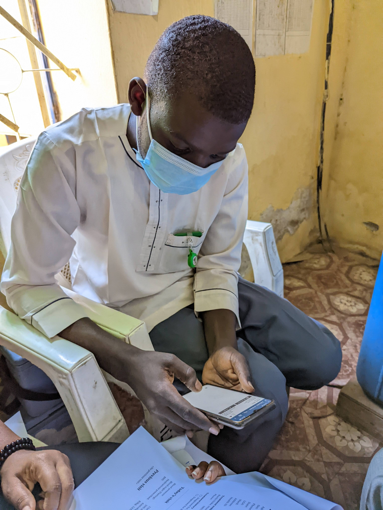
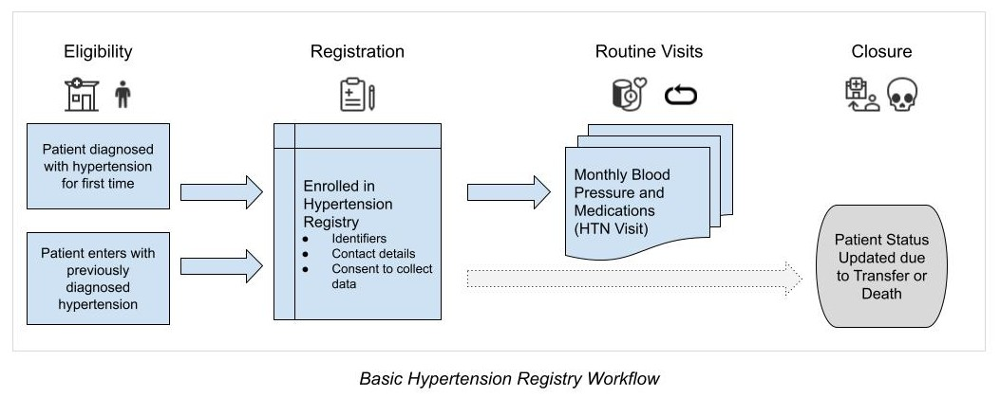
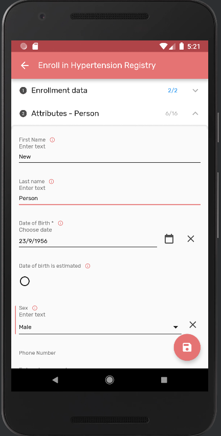
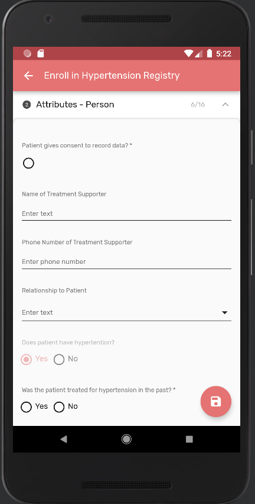
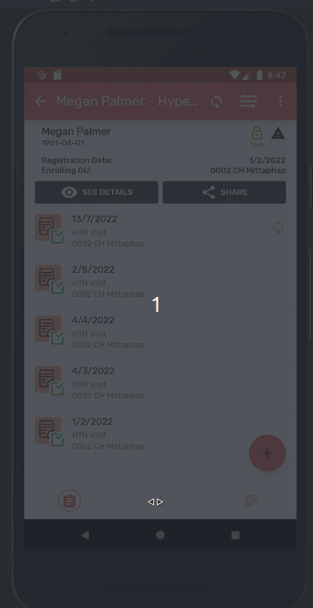
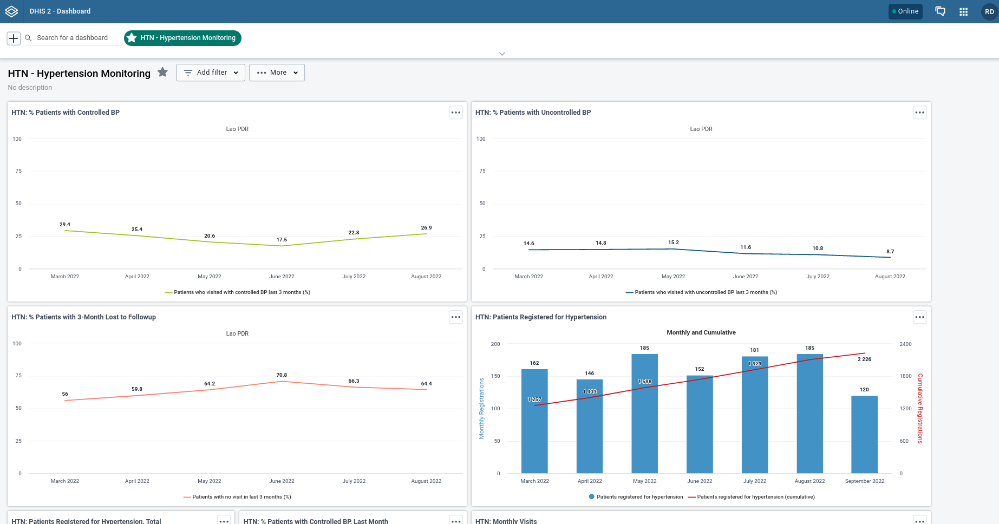
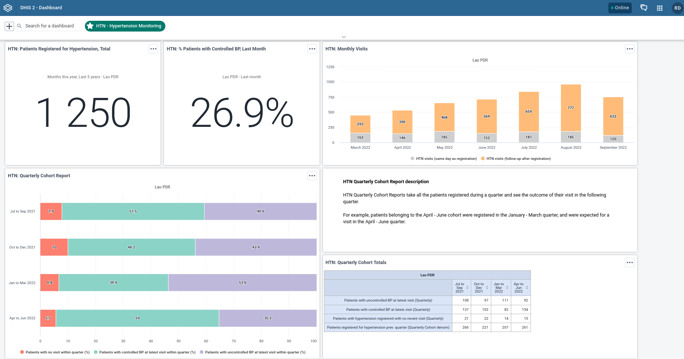
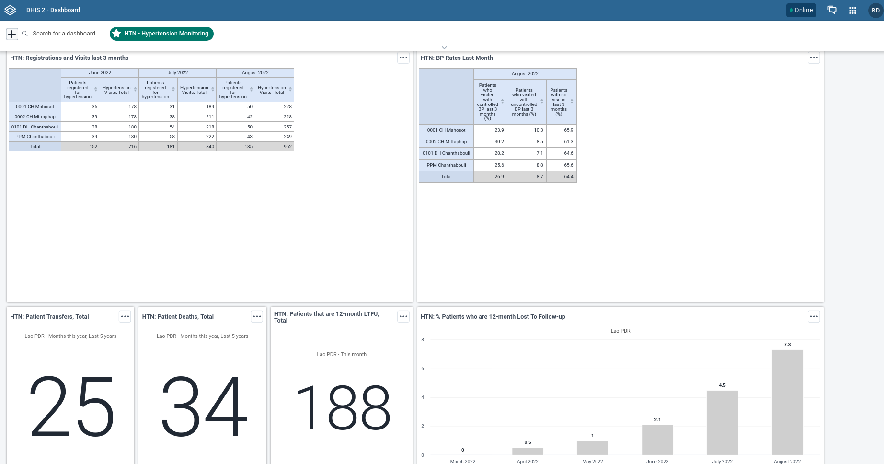

# Hypertension Registry System Design { #ncd-htn-design }

## Introduction

### Purpose

This Hypertension Registry System Design Guide provides an overview of the conceptual design used to configure a DHIS2 tracker program for registering hypertensive patients and providing routine follow-up. This document is intended for use by DHIS2 implementers at country and regional level to be able to support implementation and localization of the package. Local work flows and national guidelines should always be considered in the localization and adaptation of this configuration package.

### Background

Hypertension  ̶  or elevated blood pressure  ̶  is a serious medical condition that significantly increases the risks of heart, brain, kidney and other diseases. According to the WHO, an estimated 1.28 billion adults aged 30-79 years worldwide have hypertension, most (two-thirds) living in low- and middle-income countries. Only 1 in 5 adults (21%) with hypertension have their blood pressure under control [1].

This package is based on a DHIS2 Tracker for hypertension care configured and deployed in Kano and Ogun states in Nigeria in 2021-2022, in collaboration between the Federal Ministry of Health Nigeria, National Primary Health Care Development Agency, HISP-Nigeria, WHO and Resolve to Save Lives. As of July 2022, over 16,000 hypertensive patients are being managed across over 104 primary healthcare facilities with this tool. The program is based on the design and principles of the [Simple App](https://www.simple.org/), a custom mobile application developed by RTSL and deployed in 4 countries, enrolling over 2 million patients in hypertension care as of April 2022. Indicators for the package were derived from the HEARTS Technical package for hypertension management.

Prior to the [Nigeria Hypertension Control Initiative](https://www.afro.who.int/news/nigeria-collaborates-who-curb-hypertension-introduces-control-initiative) (NHCI), there were no tools to track HTN management of patients and only incidence data "suspected cases" was available on the national DHIS2 instance. The NHCI facilitated the development of paper-based tools to track HTN management and longitudinal monitoring of patients but was fraught with operational challenges (increased workload and burden of HCWs) and data quality challenges (data inconsistencies, missing data, summation errors, untimely data) denying program managers and policy makers accurate data for decision making. These factors led to the deployment of DHIS2 Tracker across the NHCI supported facilities in Kano and Ogun state.

The key goal of this package is to improve data timeliness and accuracy, enhance data use for decision making and scale efficient  hypertension management at primary health care level. Like the Simple App, it strives for a minimal dataset on routine hypertension care to improve facility-level analysis, while minimizing reporting burden on care providers.

## System Design Overview

### Use Case

The principal end users of this system are care providers at primary health centers who see patients for monthly hypertension services. Since hypertension generally affects a broad proportion of the population, in many contexts care providers have little time to enter detailed data on hypertension patient encounters. Therefore the focus is on collecting a _limited set of data elements_ to produce three key indicators: percent of patients with controlled blood pressure, percent of patients with uncontrolled blood pressure, and percent of patients with missed monthly visits.

These indicators can be monitored on the facility level or at higher district and national levels on dashboards (see below). Aggregate outputs can later be pushed into a national HMIS instance.

Other data elements collected are instrumental for hypertension management. For example, providers enter hypertension treatments and medications provided. However, patients must be diagnosed with hypertension in order to be enrolled in the program.

Because primary health care centres often lack reliable internet, the tracker is designed for offline data capture with the DHIS2 Android app. It can also be run in the browser with the DHIS2 Tracker Capture app.

### Rationale for program structure

The fundamental goal of the program is to record monthly blood pressure checks for hypertensive patients and document the medications provided. The data collected are only needed to identify patients and manage hypertension, and should be entered as quickly as possible.

However, the Hypertension Registry could be expanded to cover related Non-Communicable diseases (NCDs) such as diabetes or CVD. This is particularly useful in scenarios where comorbidities are frequently monitored and managed by the clinician during a hypertension visit, like diabetes or cardiovascular disease.

When adapting the program for local use, diagnosis of such these other NCDs could therefore be considered eligibility for enrollment into what is currently the ‘Hypertension Registry'. Therefore, a Tracked Entity Attribute for ‘Does this patient have hypertension?’ is autofilled as ‘Yes’ during enrollment, and program indicators for hypertension reporting require this value. The approach gives an implementation flexibility to augment the program with other NCDs after roll-out has started.

Furthermore, laboratory tests, generally performed asynchronously with facility visits, can also be added as new program stages.

## Program Configuration

### Registration

For a new patient to be registered into the DHIS2 Hypertension registry, the user will first enter a number of Tracked Entity Attributes in the enrollment page. Tracked Entity attributes gather personal identifiable information (such as name, date of birth, ID number) for the purposes of patient search and validation.

In the Hypertension Registry program, sixteen Tracked Entity Attributes are included, but only five are made searchable as identifiers. The full list is available in the Metadata Reference file.

| Registration Start             |  Registration End |
|:-------------------------:|:-------------------------:|
|   |  |

Four fields are mandatory to enter during registration, noted with *

* **Date of birth**.  If the patient does not know his or her date of birth, then the care provider should provide an estimated DoB and check ‘date of birth is estimated‘, which signifies the DoB should not be considered a reliable identifier for search criteria. Entering date of birth under 10 years old and over 140 years old displays an error. After entering the date of birth, the _current_ age is calculated as a program indicator and displays in the indicators widget.

* **Consent to record data**. The patient must give their consent to electronically record their personal data before saving the enrollment. This is noted with a mandatory yes-only tracked entity attribute.

* **Was the patient treated for hypertension in the past?** The care provider will be prompted to ask if this is a new diagnosis or if the patient has been previously treated.

* **Patient status**. During registration, the patient is assumed to have an ACTIVE status, therefore this value is autofilled.

During registration the patient is also assumed to have hypertension, so this attribute is also autofilled.

Information for the patient’s supporter is also entered to assist with lost to follow up investigation.

NB: since these demographic and identifier data are often reusable across tracker programs, the tracked entity attributes can be shared by multiple DHIS2 Tracker packages. Those metadata are found in the [Common Metadata Library](https://docs.dhis2.org/en/topics/metadata/dhis2-who-digital-health-data-toolkit/common-metadata-library/design.html) (and are prefixed with “GEN -” in the attribute name).

After the user clicks Save icon, the patient is considered enrolled in the Hypertension Registry, and the first Hypertension Visit event immediately opens.

### HTN Visit

The only stage in the program is HTN visit (hypertension visit). This is assumed to repeat every month after enrollment.

There is one mandatory and one optional section in the visit:

* Hypertension Records (mandatory)
* BMI Measures (optional)

_Hypertension Records_ section is where systolic and diastolic blood pressure is recorded. Invalid blood pressure values (below 60 or above 260) are prohibited by program rule.

If a hypertensive patient is pregnant, a high blood pressure could indicate gestational hypertension. Therefore, if the patient is female, a question will appear here to confirm the patient’s pregnancy status. (Note that the Pregnancy Status data element is found in the Common Metadata Library).

This section also captures the current hypertension medications prescribed. Medications previously entered will be listed in the program indicators widget, along with the number of days since the most recent HTN visit.

At the end of this section, the user may optionally choose to take a BMI Measurement. Clicking “Yes” to either of these questions will open the section. Note that the sections is prefixed with “Tap To Add [X]” to help the Android user open those sections.

_BMI Measures_ section captures the patient’s height and weight. Entering unlikely values for patient weight (under 35 or over 180) and height (under 130 or over 210) trigger warnings via program rule.

The Body Mass Index (BMI) is then autocalculated, as is a standard classification of BMI into Underweight, Normal, Overweight, Obese, and Severe Obesity.

These classifications are based on WHO standards for Obesity and Overweight (overweight is a BMI greater than or equal to 25; obesity is a BMI greater than or equal to 30) [2]. Complementing those definitions at the lower and upper extremes are the UK’s NHS standards for severe obesity (BMI above 40) and underweight [BMI under 18.5](3).

After entered, the patient’s latest recorded BMI is displayed in the Program Indicators Widget.

### Closing the Record

If a patient is no longer being seen by the health facility, it is important to update their status, which will remove the patient’s record from the denominators of key performance indicators.

When a user encounters a record of an individual who is no longer expected at the health facility, whether due to death or transfer to another facility, the patient status can be updated.

To do this, the user goes to the TEI profile, then clicks ‘Update Patient Status’. At that point, the patient Status is unlocked, and can be changed from ‘Active’ to ‘Death’ or ‘Transferred Out’. The Profile must then be saved. Note that the Patient Status is a mandatory field, and so cannot be blank before saving the Profile.

Different health systems may have different approaches to following up with patients. When adapting to local context, it is important to consider who would be closing the record, and how often this process is performed. In Nigeria, health workers follow up with patients during home visits or by phone call, and update the patient record accordingly. Other contexts may rely on health data managers to perform a regular data cleaning exercise to remove duplicates, or contact a list of patients who are long-term lost to follow up. Still others may have a link with a national CRVS system, whereby patients who are deceased can be identified by national ID.

## Analytics

### Individual-Level Program Indicators

There are 23 program indicators and 8 indicators included within the package. Most program indicators produce counts of persons and events, while most indicators are percentages.

Aside from the program indicators used in the hypertension monitoring dashboard, five program indicators should be used exclusively at the patient level. These program indicators are marked as “Display in Reports” in the Maintenance App, and are grouped together with the Program Indicator group “HTN - Individual Level”.

* Current Age
* Patient BMI
* Total patient visits
* Days since patient’s last visit

The individual values for patients are found at the Program Indicator widget in Tracker Capture, or at the _Analytics_ tab in the Android Capture app (see below). It is important that these individual-level program indicators are not aggregated in analytics apps such as data visualizer, as the values may be misinterpreted. The charts to show can be configured in the Android Settings app.

## Dashboards

The sole dashboard included in this package is the **Hypertension Monitoring** dashboard, which provides an overview of key indicators for hypertension patient management blood pressure control. The dashboard can be viewed as a high-level program administrator user or at a local facility level.

Definitions for the dashboard indicators are closely based on definitions for reporting of [aggregate data from the Simple app](https://docs.simple.org/reports/what-we-report) as well as the [WHO HEARTS Technical Package](https://www.who.int/publications/i/item/9789240001367). The definitions are included below, and in a text box at the bottom of the dashboard.

There are three sections of the dashboard to consider.

### Key Performance Indicators

The first three monthly line charts display key performance indicators relating to blood pressure control of registered and active hypertension patients. They consider visits within the last three months for all active patients registered before the previous three months. For patients who did visit in the last three months, the indicators check whether blood pressure was controlled at their _latest_ visit.

The subsequent chart compares monthly and cumulative new registrations into the Hypertension Registry.

* **% Patients with Controlled BP:** The percentage of patients registered to a facility before the last 3 months, where the patient has a BP measure <140/90 taken within the last 3 months and their patient status is Active.
* **% Patients with Uncontrolled BP:** The percentage of patients registered to a facility before the last 3 months, where the patient has a BP measure ≥140/90 taken within the last 3 months and their patient status is Active.
* **% Patients with 3-Month Lost to Follow-up:** The percentage of patients registered at a facility before the last 3 months, where the patient did not have a visit within the last 3 months and their patient status is Active.
* **Patients registered for hypertension:** The number of patients registered at a facility where the patient is hypertensive.
* **Patients registered for hypertension (cumulative):** The total number of hypertension patients ever registered at a facility.

### Headline Figures, Monthly Visits, and Quarterly Cohort Report

The next section highlights total patients registered for hypertension and the % BP control last month. These two cards repeat information found in the earlier section for emphasis. A Monthly HTN visits chart then shows the total number of visits every month, broken down into visits the same day of registration and follow-up visits.

Below those cards is the Quarterly cohort report, rendered as a bar chart and table. This has a special call-out box to assist with interpretation:

### HTN Quarterly Cohort Report description

HTN Quarterly Cohort Reports take all the patients registered during a quarter and see the outcome of their visit in the following quarter. For example, patients belonging to the April - June cohort were registered in the January - March quarter, and were expected for a visit in the April - June quarter.

### Definitions

* **Hypertension Visits, Total:** The total number of initial or follow-up visits by a hypertensive patient the the facility.
* (_Quarterly Cohort_) **BP controlled numerator:** The number of patients with a BP <140/90 at their last visit in the quarter after the quarter when they were registered.
* (_Quarterly Cohort_) **BP not controlled numerator:** The number of patients with a BP ≥140/90 at their last visit in the quarter after the quarter when they were registered.
* (_Quarterly Cohort_) **Lost to Follow-up numerator:** The number of patients with no visit in the quarter after the quarter when they were registered.
* (_Quarterly Cohort Denominator_) **Registered for Hypertension previous quarter:** The number of patients registered to a facility in the previous quarter whose patient status is Active.

### Facility-Level Summary and Patient Transfers/Deaths/LTFU

The last section first repeats information from the top visuals, broken down by facility level (User OU x 2) for the last month. This can be very useful for a higher-level user at the district or province level to view high and weak performance among facilities. If the user only has permissions to view the dashboard at facility level, this will repeat the same

The next part of this section shows total transfers, total deaths, and total 12-month Lost to Follow Ups (as of the start of the current month) of hypertension patients. It is important to remember that while patients who died and transferred out of the system are excluded from most _denominators in indicators above, the 12-month lost to follow-up patients are still considered active, and are therefore included in all denominators_. Total Registrations and Total Visits include patients who subsequently died or transferred out.

* **Patient transfers:** Total patients registered with hypertension whose status is currently marked "Transfer Out"
* **Patient deaths:** Total patients registered with hypertension whose status is currently marked "Died"
* **% Patients who are 12-month Lost to Follow-Up**: The percentage of patients who are registered at the facility but have not had a visit for hypertension in previous 12 months.

## User groups

The users are assigned to the appropriate user group based on their role within the system. Sharing for other objects in the package may be adjusted depending on the set up. Refer to the [DHIS2 Documentation on sharing](https://docs.dhis2.org/en/topics/metadata/crvs-mortality/rapid-mortality-surveillance-events/installation.html#sharing) for more information.

| User group | Dashboard | Program Metadata | Program data |
|-|-|-|-|
| HTN admin | Can edit and view | Can edit and view | No Access |
| HTN access | Can edit and view | Can view only | Can view only |
| HTN data capture | No access | Can view only | Can capture and view |

## Android Settings App

The Hypertension Registry is designed to be used offline on Android devices, and to capture data for thousands of patients on a monthly basis. It is therefore critical to consider the Android synchronizaton settings, found within the DHIS2 Android settings app ([see documentation here](https://docs.dhis2.org/en/use/android-app/settings-configuration.html)).

You may for example consider a setting where a facility level device automatically downloads all patients assigned to each facility, who had a HTN event or registration in the previous three months. If a patient not fitting outside those criteria comes to the facility, the user would need to search online to find their record.

Metadata and data should be synced at the same time, on a daily basis if possible, to avoid conflicts.

In the Android settings app, different settings for Android app appearance and visualizations can also be configured for the system. These settings are worth exploring during the adaptation and testing phase before any deployment.

## References

1 - World Health Organization (25/08/2021). Hypertension Key Facts. Retrieved from: <https://www.who.int/news-room/fact-sheets/detail/hypertension> (Accessed on 19/09/2022)

2 - World Health Organization (09/06/2021). Obesity and Overweight Fact Sheet. Retrieved from:   [https://www.who.int/news-room/fact-sheets/detail/obesity-and-overweight](https://www.who.int/news-room/fact-sheets/detail/obesity-and-overweight) (Accessed on 19/09/2022)

3 - National Health Service (16/05/2022). Overview: Obesity. Retrieved from: [https://www.nhs.uk/conditions/obesity/](https://www.nhs.uk/conditions/obesity/) (Accessed on 19/09/2022)
